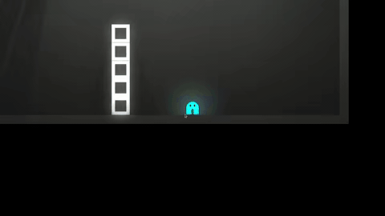

# chronodrifter

## https://jasonchadwick.github.io/chronodrifter/

Platform puzzler where the direction of time flow can change.

|  |
|:--:|
|Player getting on top of a tower of blocks by knocking them over and then reversing time.|

## TODO
- player can grab and move objects
  - lots of potential to use this with time reversal
- enemies
 - shoots a ray that freezes you in time (or reverses you!)
 - bomb robot that rolls after you and explodes
 - boss: has the same time reversing powers as you
- more levels and obstacles
- music/sounds
- better UI (buttons, main menu etc)
- destructible objects (reassemble when inverted)
- flowing liquids?
